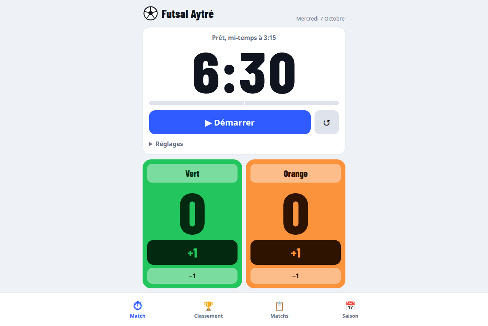
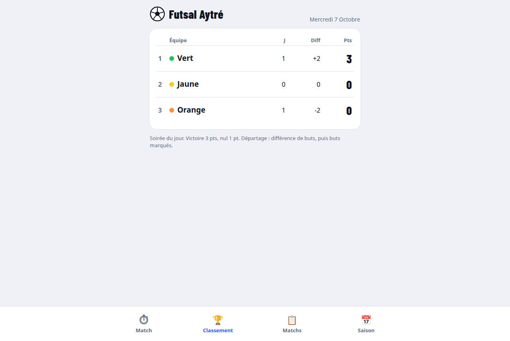
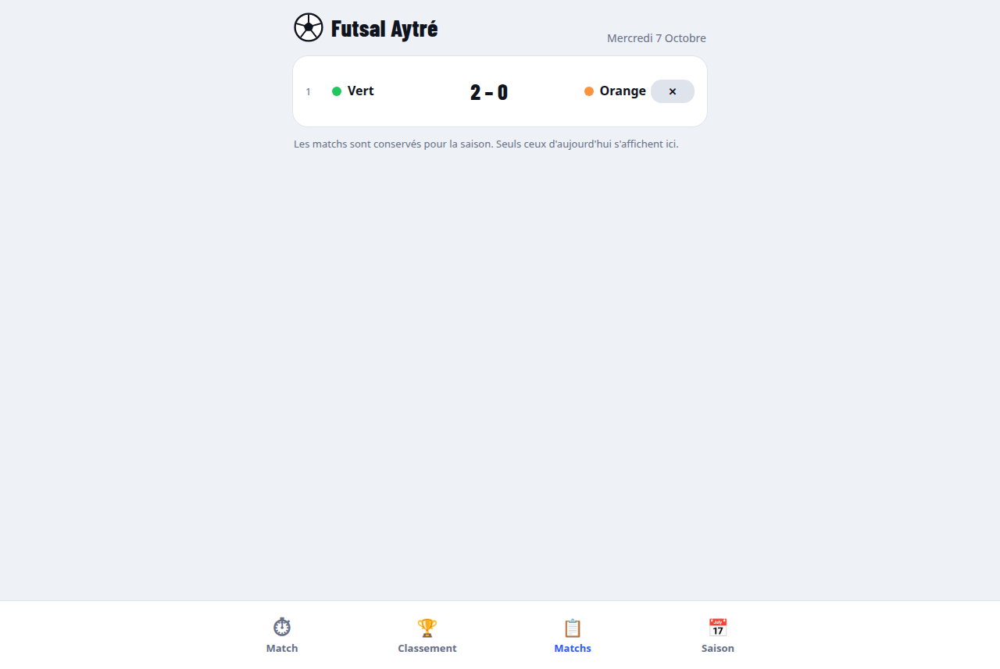
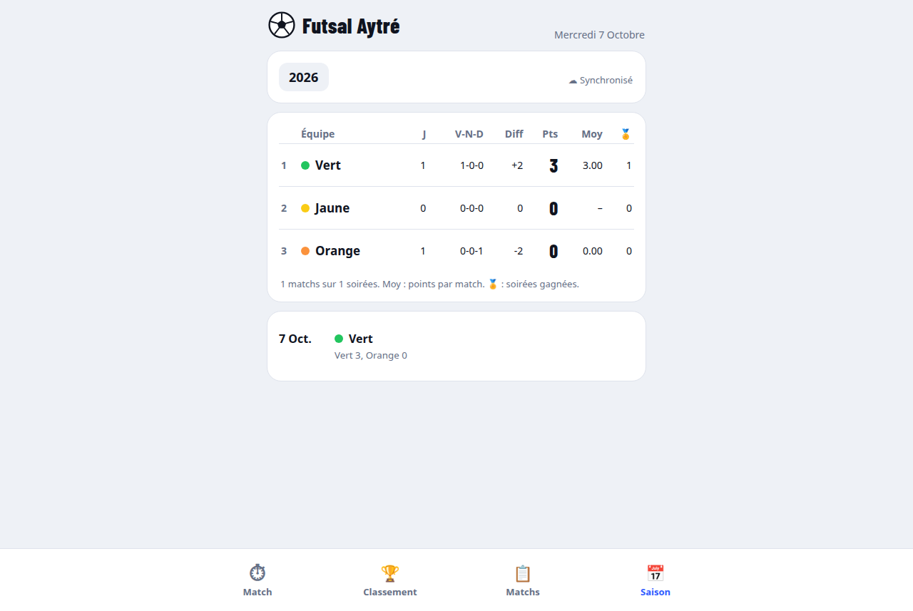

# Futsal Aytré

Application web pour gérer les matchs d'une soirée futsal : chronomètre, scores, rotation des équipes et classement.

[Ouvrir Futsal Aytré](https://futsal-aytre.xaadim.dev)

## Fonctionnalités

- Chronomètre de match configurable avec alertes de mi-temps et de fin.
- Saisie des scores et rotation des équipes après chaque match.
- Classement de la soirée et historique des matchs du jour.
- Statistiques de saison et synchronisation des résultats.

## Captures d'écran

### Match

### Classement

### Matchs

### Saison

